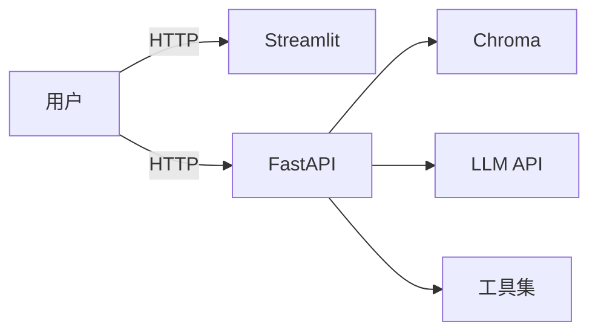

# Day 59 · 作品冲刺

> 本节时长: 6 小时(约 6 节 × 45 分钟)
> 前置: Day 58 已选定方向 + 搭好项目骨架;已有一个能跑的最小 demo;
>    明确了 3 天里程碑
> 关键问题: Day 59 是答辩前唯一完整开发日 —— 如何抓大放小、
    写出能演示的成品,同时为答辩准备好文档和 demo 脚本?

---

## 0. 引入(5 分钟)

- **进度检查**(3 分钟):快速问卷 —— 你的 demo 能跑起来了吗?举手
    "能跑" / "还没跑" / "正在调 bug"。针对"没跑"的同学,助教 5 分钟
    内到场协助,卡住超过 30 分钟必须调整范围,不钻牛角尖。
- **今日目标剧透**(2 分钟):Day 59 结束时要达成"**能演示 5 分钟 +
    文档齐全 + Docker 能一键启动**"三件事。

---

## 1. 第一讲(15 分钟) —— 开发最佳实践

### 知识点 1.1 版本控制纪律

```bash
# 每次提交前先改一点,不要攒一周一起交
git add -p               # 逐块审阅本次改动
git commit -m "feat: 接入 Chroma 向量检索"

# commit message 规范(feat: 新功能 / fix: 修 bug / docs: 文档)
fix: 流式响应 proxy_buffering 未关导致打字机效果失效
docs: 补充 README 中 .env.example 填写说明
```

> 为什么这重要?答辩时评审 git log 一眼看穿"是不是昨天才开始"。
>    每天 3-5 个原子 commit,体现持续投入。

### 知识点 1.2 代码审查就一条规则

提交前问自己一个问题:**"助教打开这个 PR,能不能不问我任何问题就
看懂在做什么?"** 看不懂就补注释;注释不是给机器看的,是给 3 个月后的你自己和评审看的。

```python
# ❌ 别人不知道你为什么这么写
if score < 0.35:
    return "未找到"

# ✅ 立刻明白为什么选 0.35
# 低于 0.35 视为"相关性不足"(实测 50 次查询误报率 12%)
RELEVANCE_THRESHOLD = 0.35
if score < RELEVANCE_THRESHOLD:
    return "未找到"
```

## 2. 当堂练 1(20 分钟)

- 练习 1: `in_class/practice01.py` —— 找自己项目里的 3 段"只有自己
    看得懂"的代码,重写命名 + 加注释后 commit,commit message 用
    `refactor:`/`docs:` 前缀(⭐⭐,20 分钟)

> 巡场重点: 看 commit message 是否中文混英文(统一中文即可);看是
>    否真的改了命名而不是"// 改了一下"。

---

## 3. 第二讲(20 分钟) —— 常见问题排查

### 知识点 3.1 LLM 调用失败的 4 个高频原因

| 现象 | 可能原因 | 排查 |
|---|---|---|
| 504 Timeout | 网络慢或 prompt 太长 | 加 timeout / 缩短 context |
| 401 Unauthorized | Key 过期或填错 | 控制台确认 Key 余额 |
| 429 Rate Limited | 请求太频繁 | 加指数退避 / 降频 |
| 空回复或乱码 | 流式拼接错 | 检查 `if delta:` 和 utf-8 |

### 知识点 3.2 向量库性能排查

```python
# 查询慢?先看文档数
print(f"索引文档数:{collection.count()}")
# 10 万以上 IndexFlatIP 会慢 → 换 IndexHNSWFlat

# 结果不相关?检查嵌入维度是否一致
vec = model.encode(["测试"])
print(vec.shape)  # 确认与建库时同维度,换模型须重建库

# Chroma 进程占用内存过大 → 重启或分批插入
```

### 知识点 3.3 Docker 网络 3 大坑

| 现象 | 解决 |
|---|---|
| 容器间无法通信 | 用服务名(`chroma:8000`)而非 `localhost` |
| 容器内连不上宿主机 | Mac/Win 用 `host.docker.internal` |
| 数据容器删了就没 | 必须挂 `volumes:` 持久化 |

### 知识点 3.4 Streamlit 常见坑

```python
# 坑 1:刷新页面丢失状态 → 用 session_state
if "history" not in st.session_state:
    st.session_state.history = []

# 坑 2:耗时操作卡死页面 → 用 @st.cache_data 缓存
@st.cache_data
def expensive_query(question):
    return rag_answer(question)

# 坑 3:按钮点两次重复提交 → 用 st.form
with st.form("qa_form"):
    q = st.text_input("问题")
    submitted = st.form_submit_button("提问")
```

> 🔴 教学红线(UI 里直接调 LLM): 不在 `if submitted:` 内加判断就
>    直接调 LLM,会导致每次页面重渲染都重新调一次 —— 烧 token 且
>    界面闪烁。

## 4. 当堂练 2(25 分钟)

- 练习 2: `in_class/practice02.py` —— 故意在自己项目里制造 3 个 bug
    (Key 错 / 维度不匹配 / 忘加 session_state 初始化),记录排查
    思路,然后修复。提交一个 `fix:` commit(⭐⭐⭐,25 分钟)

> 巡场重点: 看学员是否用二分法或日志定位(而不是"乱改一通试");
>    看 commit message 是否写了修复了什么。

---

## 5. 第三讲(20 分钟) —— Demo 演示技巧

### 知识点 5.1 5 分钟 demo 结构

```
0:00-0:30   一句话讲清楚"我为谁解决了什么问题"
0:30-2:00   现场演示"用户视角"(输入 → 看输出,不点代码)
2:00-3:30   打开架构图讲"里面怎么跑"(展示技术深度)
3:30-4:30   讲一个"踩过的坑 + 怎么解决"(真实工程感)
4:30-5:00   Q&A 过渡("这就是我的作品,欢迎提问")
```

> 第一句话花 30 秒定调 —— 讲清楚"为谁解决什么问题"远比"我用了
>    哪些技术"更重要。

### 知识点 5.2 备用方案(demo 必死定理)

- **网络挂了**:提前录屏一份(mp4)做备用,断网也能播
- **API Key 耗尽**:用 Ollama 本地模型做备份 demo
- **Docker 起不来**:本地直接 `streamlit run` 跑,不做容器演示

> 录制命令(提前装 `ffmpeg`):
>    `ffmpeg -y -f avfoundation -i :0 -t 30 demo_noaudio.mp4`
>    或 OBS 录屏 —— 评审更希望看你"侃侃而谈"而不是等 Docker 转圈。

## 6. 当堂练 3(25 分钟)

- 练习 3: `in_class/practice03.py` —— 写 demo 的演讲稿(每段 3-5 句),
    计时排练;和同桌交换,互相挑出问题(⭐⭐⭐,25 分钟)

> 巡场重点: 看是否"I have a demo"占了 4 分钟;看是否有"备用方案"
>    的自觉。

---

## 7. 文档撰写(45 分钟) —— README + 架构图 + API 文档

### 知识点 7.1 README 必含内容

README 模板骨架(直接 copy 改):

````md
# 项目名

> 一句话描述:为解决 XX 人群的 XX 问题

## 功能
- 特性 1(截图 / gif)
- 特性 2

## 快速开始
\`\`\`bash
git clone ... && cd ...
cp .env.example .env   # 填入你的 API Key
docker compose up -d
# 浏览器打开 http://localhost:8501
\`\`\`

## 技术架构
(架构图 —— 可以 mermaid 语法画)

## 项目结构
(贴项目目录树)

## 亮点 / 难点
1. xxx
2. xxx

## 后续计划(选做)
- 支持多用户
````

> 评审 30 秒决定是否入眼 —— README 是你的"求职简历"。

### 知识点 7.2 架构图:mermaid 内嵌 README



> GitHub 原生渲染 mermaid,README 放一张胜过 500 字。

### 知识点 7.3 API 文档:用 FastAPI 自带的 /docs 截图

把 `/docs` 截图贴 README,让评审一眼看到有哪些接口、参数是什么。
复杂项目额外写 `docs/api.md`。

## 8. 总结(5 分钟)

- **本日错 3 件事**(教师课后把真实错例填进 `teacher_notes.md`):
  1. 5 分钟 demo 花 3 分钟讲"我用了哪些库、哪个版本" —— 评审想听
     结果,不是 Dockerfile
  2. 没有备用方案,答辩当天 LLM API 限频,全场等了 5 分钟
  3. 项目结构混乱,评审打开仓库不知道入口文件是哪个,因为
     README 没给快速开始
- **作业说明**: 课后 `homework/task01.py` —— 完成 README 全文 +
    至少一份 mermaid 架构图 + 本地 demo 彩排 ≤ 5 分钟,明天答辩。

---

## 易错点

1. **commit message 乱写 "update"**: 5 个 update 和没写一样,用
    `feat:` / `fix:` / `docs:` 前缀,让 git log 可读。
2. **demo 超时**: 5 分钟切 10 分钟会被打断,修剪内容而非加速讲。
3. **没录屏备份**: API 限频概率 >30%,录屏 = 保险。
4. **文档不写快速开始**: 评审 clone 后跑不起来就直接 pass。
5. **隐藏 bug 不敢暴露**: 主动讲"这个还没解决,因为..."反而加分 ——
    评审看到你诚实 + 有分析。

## 延伸题

- **(接受反馈, ⭐⭐)**: Day 59 下午找 2 个同学试玩,记录他们的"卡
    住点" + 修改,这比你自己测 100 次更有效。
- **(性能压测, ⭐⭐⭐)**: 用 `locust` 模拟 10 人并发,看 API 响
    应时间是否符合预期,把结果截图贴 README。
- **(自动化部署, ⭐⭐⭐⭐)**: 在 `.github/workflows/` 加一个 deploy
    配置, push to main 自动部署 —— 面试讲"我有 CI/CD 实践"。
